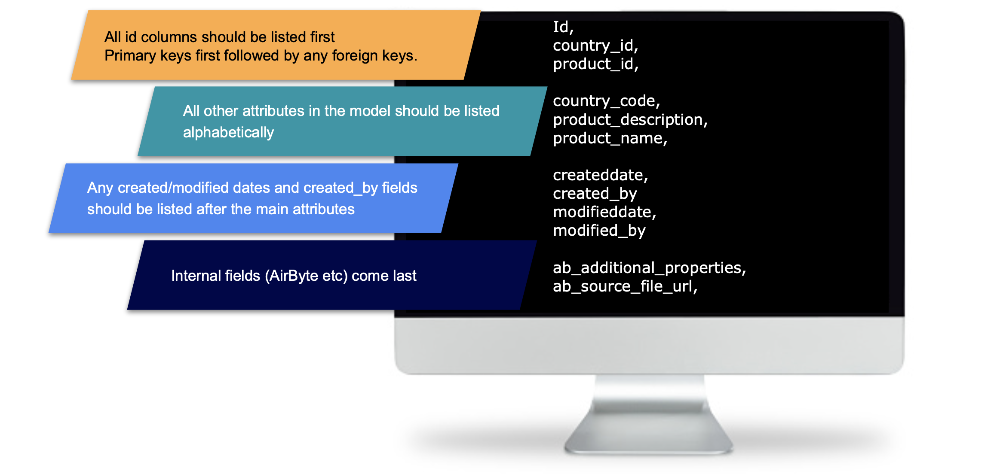

# dbt Guidelines

## dbt Recommendations

- When a model has too much code, rather than using a subquery or CTE (with statement) to separate logic in a model, create a new model. This can be imported as an ephemeral model, but makes logic easier to manage.

- All ref and source references in a model should be included with selected fields at the top of the file as a CTE (with statement); allowing quick visibility of where the data comes from in a given model.

- Rather than adding new models to a team folder, think about where the model best fits in the overall project. Hierarchy and organizational projects can change, but your company will always care about 'Events' and 'Customers'.

- Rather than creating a new model, first search for any existing models that may achieve the same outcome. While in the early stages most logic will be new, over time this will save a lot of development effort.

- Rather than applying the same transformation manually in a number of places, consider creating a macro. It's a straightforward process for an experienced SQL developer and will make it much easier the next time you need it.

- Rather than applying just the required tests & documentation to your code, consider what you can put in place to avoid ever seeing this model again. If the logic is well tested and documented (both in the description and with --inline comments for complex sections) it will stand the test of time.

- Rather than describing the reason for a change in the column description, the reason for change should be listed in the git commit message; the description should only describe what is, not what used to be.

- Rather than developing complex queries against all data in the Development environment, consider adding a where condition to run just the most recent data - it will speed up query time, and with a  statement can be easily removed for testing and production.

- Rather than using *singular* tests, *generic* tests (defined in yml files) should be used wherever possible.

- Where a *singular* test (defined in /testing) is required, the folder structure under /tests should match the structure in /models for the primary model being tested.

- All models should be initially created as views or ephemeral; moving to tables / incremental tables where required for performance.

### Model attribute layout

- Any id columns should be listed first in a model (model key first, followed by any foreign keys

- Any created/modified dates should be listed last in a model, followed by internal fields (AirByte etc)

- All other fields in the model should be listed alphabetically, as contents may change over time.

