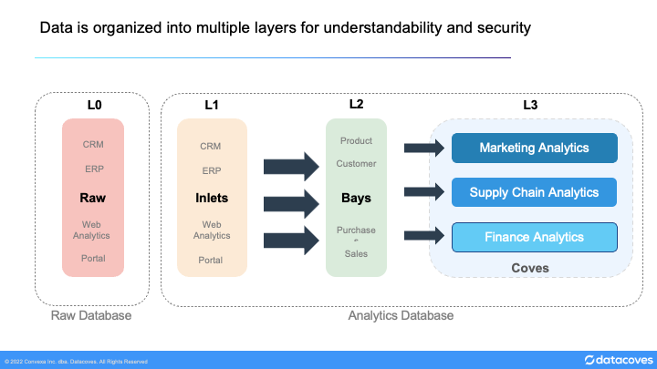
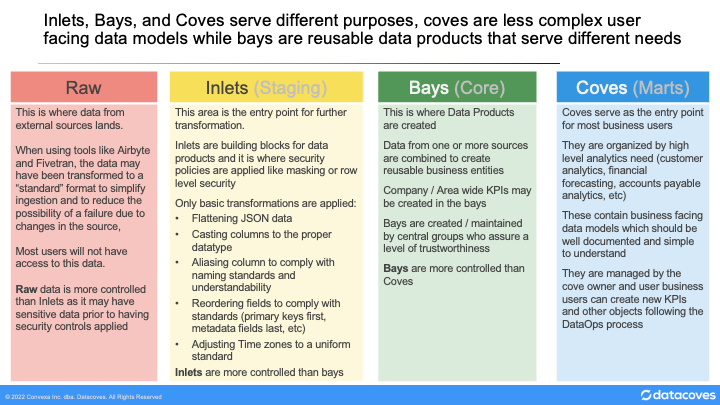
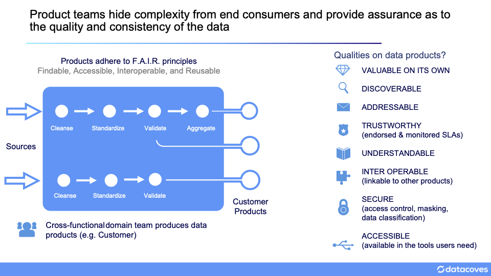

# What are Inlets, Bays & Coves

Before companies start creating data warehouses or data lakes, they typically run their business with spreadsheets. Different areas of the business do analysis by combining different data sets to produce the metrics they need.

An Accounts Payable analyst may have a file containing vendors, another containing invoices, and another containing purchase orders. With a few files this person can do their job.

However, as the volume of data increases, Excel becomes unusable and these users are sent to gather the data they need from the data warehouse or data lake. Usability suffers and the organization becomes less agile.

## The Datacoves approach

We want to give users an area where they can find the things they need to do their job, tailored to their use cases. These are Data Coves. In practical terms, they are schemas in a data warehouse that are tailored for a specific area of the business, in the example above, we would have an accounts_payable cove.

## Data Flow

A Data Cove is a user centric data area, but data doesn't start out this way. Companies receive data that needs to be cleansed and harmonized. Before data is made available to end users, we should also assure that some level of data quality checks are performed. This is what happens in the **inlets** and **bays**. These areas may also be referred to as "staging" and "core".

## Raw

This area mirrors the source system. It is where data is loaded into the warehouse. Raw data feeds **Inlets**.

## Inlets

This area mirrors the raw database and it is where basic transformations such as renaming of columns, casting data to the proper data type, and harmonizing timezones is done. Inlets feed **bays**.

## Bays

Bays are where we build *reusable* Data Products that adhere to Data Mesh principles. These should be thought of as business objects that do not change over time. While systems like a CRM may change, objects like Customers, Vendors, Employees, Orders, Online Interactions, etc remain constant over time.

Bays feed the analytic **Coves**.

## Coves

A cove is an analytics centric area focused on usability. It also adheres to Data Mesh principles.

While a Bay may have a model for a customer dimension that may have hundreds of columns, when we expose that model in a cove we take into consideration which of those columns are needed by the given analytics area.

Continuing from the example above, an accounts payable analyst that sees what is available in their accounts_payable cove should immediately be able to use the data just as they traditionally used their excel datasets.

The diagram below illustrates how data flows between each layer and what takes place in each.

## Building Bays and Coves

As stated above, Bays and Coves should adhere to Data Mesh principles and should have clear ownership. Data products are created and the complexity that goes into  building them is encapsulated for future modification.

The diagram below shows the qualities of data products.

