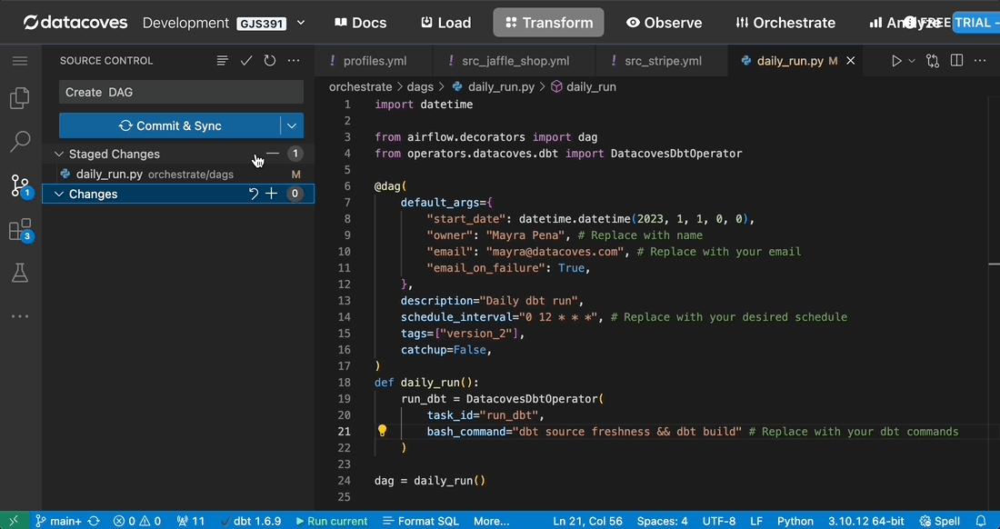
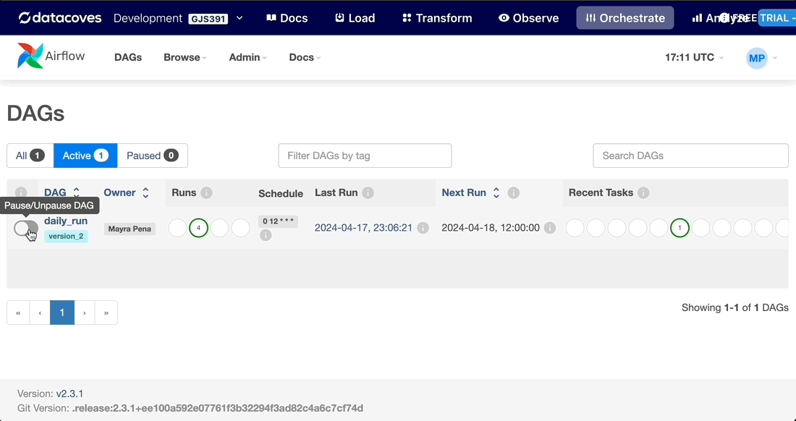

# Deploy your Jobs 🚀

Now that you have completed the setup for Airflow in Datacoves we will walk you through migrating your dbt jobs to Airflow. For this example we will be migrating the Jaffle Shop `daily_run` job. 

**Step 1:** Inside your newly created `orchestrate/dags` directory create a file named `daily_run.py`. My dbt job was called daily run so I will name my DAG file `daily_run`. This can be replaced with your specific job names.

**Step 2:** Figure out what dbt commands are being run for your dbt Cloud job by heading into the job UI in dbt Cloud. Do not include `dbt deps` and `dbt generate docs` commands since these commands be taken care of for you. 

For example:

I have a job named daily_run in dbt Cloud and it runs the following commands: `dbt_deps, dbt source freshness, dbt build, dbt docs generate`. This will translate to `dbt source freshness && dbt build` bash command for Airflow since `dbt deps` and `dbt generate docs` commands are taken care of for you. 

**Step 3:** Inside `daily_run.py` paste the following code and be sure to replace the `bash_command` values with your own dbt commands following this syntax `command 1 && command 2 && ...`

```python
import datetime

from airflow.decorators import dag
from operators.datacoves.dbt import DatacovesDbtOperator

@dag(
    default_args={
        "start_date": datetime.datetime(2023, 1, 1, 0, 0),
        "owner": "Noel Gomez", # Replace with name
        "email": "gomezn@example.com", # Replace with your email
        "email_on_failure": True,
    },
    description="Daily dbt run",
    schedule_interval="0 12 * * *", # Replace with your desired schedule 
    tags=["version_2"],
    catchup=False,
)
def daily_run():
    run_dbt = DatacovesDbtOperator(
        task_id="run_dbt", 
        bash_command="dbt source freshness && dbt build" # Replace with your dbt commands
    )

dag = daily_run()
```

**Step 4:** Commit and push your changes. Then head over to the Airflow UI in Datacoves to see your DAG.



**Step 5:** By default the DAG is paused you can use the toggle on the left to turn it on. You can also test this DAG you can selecting the play button on the left to trigger it. 




**Step 6:** To see the status of the DAG
-  Click into it the dag 
-  Select the node on the graph 
-  Select logs. 
 
Here you will see your dbt commands being executed as well as any errors.


## Next Steps

The final step is to [deploy your dbt docs](getting-started/dbt-cloud-migration/deploy-dbt-docs.md).


  