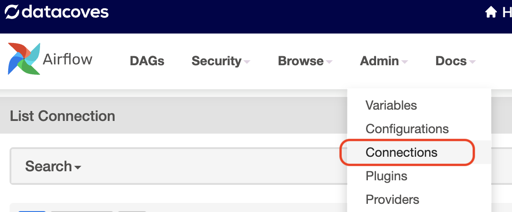

# Run Airbyte sync jobs

In our quest to simplify the way the different tools integrate together in the Modern Data Stack, we took a public project named [DAG Factory](https://github.com/ajbosco/dag-factory) which helps Analysts create Airflow DAGs using just yaml files, and enhance it by creating what we call `TasksGenerators`.

The main idea behind this concept is to read data from different systems (e.g. Airbyte's metadata) and dynamically create tasks that are connected to different sync jobs and can be dynamically triggered in an Airflow DAG.

We've just added support for triggering `Fivetran` jobs! You can read more at [run Fivetran sync jobs](/how-tos/airflow/run-fivetran-sync-jobs).

## Before you start

### Ensure your Airflow environment is properly configured

Follow this guide on [How to set up Airflow](/how-tos/airflow/initial-setup)'s environment.

### Airbyte connection

As Airflow will need to retrieve metadata from Airbyte's server, you need to set up a connection in Airflow.

If you were granted admin privileges, go to `Admin -> Connections` menu.



Create a new connection using the following details:


Where `host` is formed by your `<environment id> (3 letters + 3 digits) + "-airbyte-airbyte-server-svc"`.

### Turn off Airbyte's scheduler

To avoid conflicts between Airflow triggering Airbyte jobs and Airbyte scheduling its own jobs at the same time, we suggest you set `replication frequency` to `manual` on each Airbyte's connection that is going to be triggered from Airflow:


## Example DAG

In the following example DAG, you can notice a special task `load` that uses a `generator` instead of an `operator`.

### Fields reference:

- **generator**: The Airbyte Tasks Generator is being used thanks to the value `dagfactory.AirbyteDbtGenerator`.
- **airflow_connection_id**: Id of the airflow connection that hold the information to connect to the source system
- **dbt_project_path**: Relative path to dbt project, used to run `dbt ls` to discover sources
- **task_group_name**: Group where tasks will be grouped into
- **virtualenv_path**: Virtualenv path that contains the `dbt` library
- **dbt_list_args**: arguments sent to `dbt ls` to retrieve the dbt project sources used to retrieve Airbyte connections. The Tasks generator will match the Airbyte connections using destination's database, schema and relation name.

### YAML version

```yaml
example_dag:
  ...
  task_groups:
    extract_and_load:
      tooltip: "Extract and Load tasks"
  tasks:
    load:
      generator: dagfactory.AirbyteDbtGenerator
      airflow_connection_id: airbyte_connection
      dbt_project_path: transform
      task_group_name: extract_and_load
      virtualenv_path: /opt/datacoves/virtualenvs/main
      dbt_list_args: "--select tag:loan_daily"
    transform:
      ...
```
