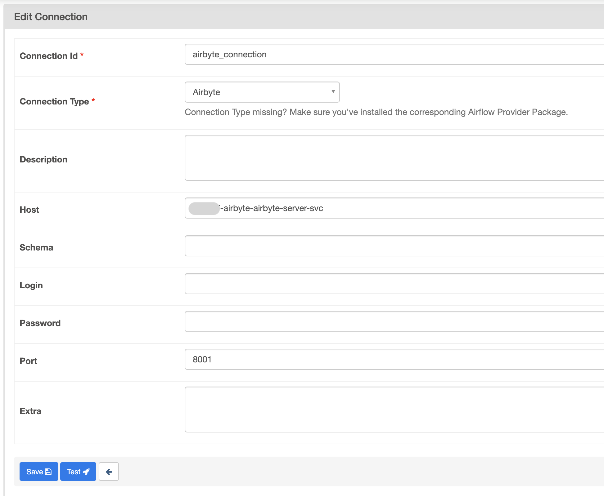
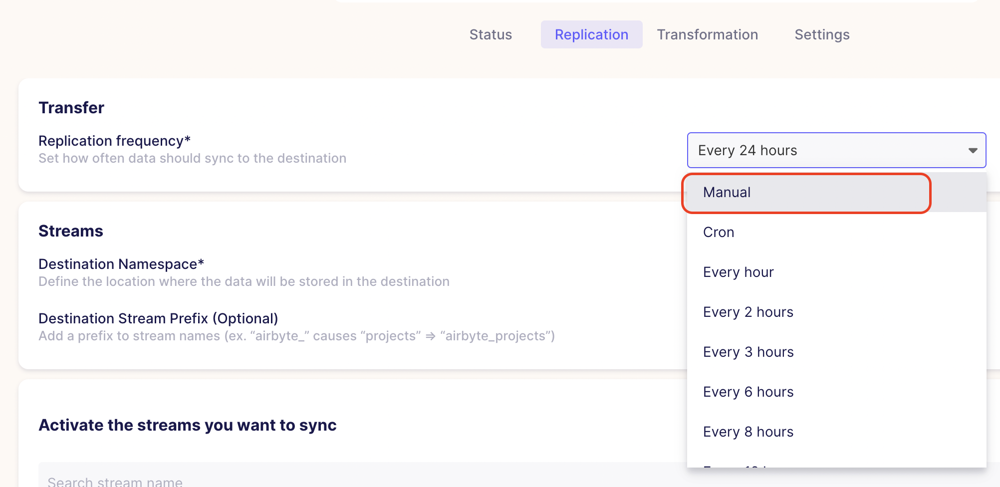

# Run Airbyte sync jobs

In our quest to simplify the way the different tools integrate together in the Modern Data Stack, we took a public project [DAG Factory](https://github.com/ajbosco/dag-factory) which helps Analysts create Airflow DAGs using just yaml files, and enhanced it by creating what we call `TasksGenerators`.

The main idea behind this concept is to use tags defined on dbt sources and read determine which data to load via different tools (e.g. Airbyte or Fivetran). Using this information, we can dynamically create _Extract and Load_ tasks in an Airflow DAG before running dbt.

In addition to Airbyte, we also support Fivetran Tasks. You can learn how to [run Fivetran sync jobs](/how-tos/airflow/run-fivetran-sync-jobs).

## Before you start

### Ensure your Airflow environment is properly configured

Follow this guide on [How to set up Airflow](/how-tos/airflow/initial-setup)'s environment.

### Airbyte connection

As Airflow will need to retrieve metadata from the Airbyte's server, you need to set up a connection in Airflow.

A user with Airflow admin privileges must go to the Airflow `Admin -> Connections` menu.


There they create a new connection using the following details:



Where `host` is created using your environment (3 letters + 3 digits like xyz123) `<environment slug> + "-airbyte-airbyte-server-svc"`.

### Turn off Airbyte's scheduler

To avoid conflicts between Airflow triggering Airbyte jobs and Airbyte scheduling its own jobs at the same time, we suggest you set `replication frequency` to `manual` on each Airbyte connection that that will be triggered by Airflow:



## Example DAG

In the following example DAG, you can notice a special task `load` that uses a `generator` instead of an `operator`.

### Field reference:

- **generator**: The Airbyte Tasks Generator uses the value `dbt-coves.AirbyteDbtGenerator`.
- **airflow_connection_id**: Id of the airflow connection that holds the information to connect to Airbyte system. (this was set up above)
- **dbt_list_args**: arguments sent to `dbt ls` to retrieve the dbt project sources used to retrieve Airbyte connections. The AirbyteDbtGenerator generator will find the Airbyte connections to trigger using dbt sources's database, schema and table name.

### YAML version

```yaml
example_dag:
  ...
  # DAG Tasks
nodes:
  extract_and_load_airbyte:
    generator: AirbyteDbtGenerator
    type: task_group

    tooltip: "Airbyte Extract and Load"
    dbt_list_args: "--select tag:daily_run_airbyte"

  transform:
      ...
```

### transform/.dbt-coves/config.yml

Below are the configurations in for dbt-coves airflow-dags.

### Field reference:
- **yml_path**: Relative path to dbt project where yml to generate python DAGS will be stored
- **dags_path**: Relative path to dbt project where generated python DAGS will be stored
- **host**: Replace the `datacoves-environment-slug` with your own
- **dbt_project_path**: Relative path to dbt project, used to run `dbt ls` to discover sources


```yaml
airflow_dags:
    secrets_manager: datacoves
    secrets_tags: "extract_and_load_fivetran"
    yml_path: /config/workspace/orchestrate/dags_yml_definitions/
    dags_path: /config/workspace/orchestrate/dags/
    generators_params:
      AirbyteDbtGenerator:
        host: http://<datacoves-environment-slug>-airbyte-airbyte-server-svc
        port: 8001
        airbyte_conn_id: airbyte_connection

        dbt_project_path: /config/workspace/transform
        run_dbt_compile: true
        run_dbt_deps: false

      AirbyteGenerator:
        host: http://<datacoves-environment-slug>-airbyte-airbyte-server-svc
        port: 8001
        airbyte_conn_id: airbyte_connection      
  ```