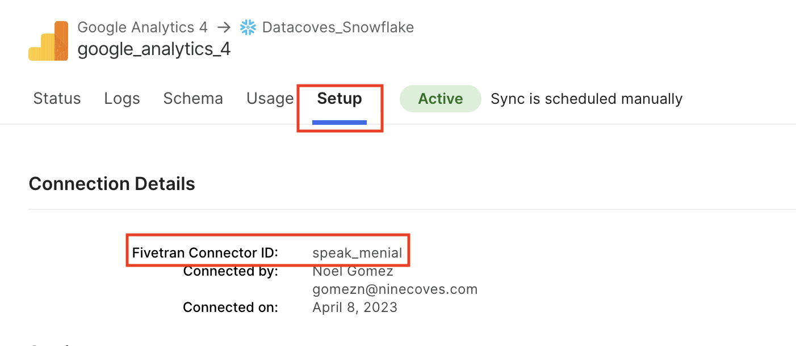

# Run Fivetran sync jobs

In Addition to triggering Airbyte loads jobs [run Airbyte sync jobs](/how-tos/airflow/run-airbyte-sync-jobs)) you can also trigger Fivetran jobs from your Airflow DAG.

## Before you start

### Ensure your Airflow environment is properly configured

Follow this guide on [How to set up Airflow](/how-tos/airflow/initial-setup)'s environment.

### Fivetran connection

Airflow needs to be connected to your Fivetran account to both read and trigger your Connectors, so first you need to set up a connection.

A user with Airflow admin privileges must go to the Airflow `Admin -> Connections` menu.


Create a new connection using the following details:


You can find, or generate, your Fivetran `API Key` and `API Secret` in [Fivetran Account settings](https://fivetran.com/account/settings)

### Configure your transform/.dbt-coves/config.yml file

Currently, dbt-coves does not query the necessary information for Fivetran Extract and load. You will need to configure these in your yml DAG.
Below are the configurations in for dbt-coves airflow-dags. You will need to configure these if using dbt-coves to generate DAGS from YML

### Field reference:
- **yml_path**: Relative path to dbt project where yml to generate python DAGS will be stored
- **dags_path**: Relative path to dbt project where generated python DAGS will be stored

```yaml
airflow_dags:
    yml_path: /config/workspace/orchestrate/dags_yml_definitions/
    dags_path: /config/workspace/orchestrate/dags/
```

## Example DAG

### Fields reference
- **extract_and_load_fivetran**: The name of the task group. This can be named whatever you like and will show up in airflow.

- **tooltip**: The tooltip argument allows you to provide explanatory text or helpful hints about specific elements in the Airflow UI
- **tasks**: Define all of your tasks within the task group.

You will need to define two operators: `fivetran_provider.operators.fivetran.FivetranOperator` and `fivetran_provider.sensors.fivetran.FivetranSensor`
- **example_task_trigger**: Name your trigger task accordingly and define arguments below.
  - **operator**: `fivetran_provider.operators.fivetran.FivetranOperator`
  - **connector_id**: Find in Fivetran UI. Select your desired source. Click into `Setup` and locate the `Fivetran Connector ID`
  
  - **do_xcom_push**:  Indicate that the output of the task should be sent to XCom, making it available for other tasks to use.
  - **fivetran_conn_id**: This is the `connection_id` that was configured above in the Fivetran UI as seen [above](#id=fivetran-connection).
- **example_task_sensor**: Name your Sensor task accordingly and define arguments below.
  -  **operator**: `fivetran_provider.sensors.fivetran.FivetranSensor`
  -  **connector_id**: Find in Fivetran UI.
  -  **poke_interval**: The poke interval is the time in seconds that the sensor waits before rechecking the condition it's waiting for. Defaults to 60.
  - **fivetran_conn_id**: This is the `connection_id` that was configured above in the Fivetran UI as seen [above](#id=fivetran-connection).
  - **dependencies**: A list of tasks this task depends on.
### YAML version

```yaml
description: "Loan Run"
schedule_interval: "0 0 1 */12 *"
tags:
  - version_1
default_args:
  start_date: 2024-01
catchup: false

# DAG Tasks
nodes:
  # The name of the task group. Will populate in Airflow DAG
  extract_and_load_fivetran:
    type: task_group
    # Change to fit your use case
    tooltip: "Fivetran Extract and Load"
    tasks:
      # Rename with your desired task name. We recommend the suffix _trigger
      datacoves_snowflake_google_analytics_4_trigger:
        operator: fivetran_provider.operators.fivetran.FivetranOperator
        # Change this to your specific connector ID 
        connector_id: speak_menial
        do_xcom_push: true
        fivetran_conn_id: fivetran_connection
      # Rename with your desired task name. We recommend the suffix _sensor
      datacoves_snowflake_google_analytics_4_sensor:
        operator: fivetran_provider.sensors.fivetran.FivetranSensor
        # Change this to your specific connector ID 
        connector_id: speak_menial
        # Set your desired poke interval. Defaults to 60.
        poke_interval: 30
        fivetran_conn_id: fivetran_connection
        # Set your dependencies for tasks. This task depends on datacoves_snowflake_google_analytics_4_trigger
        dependencies:
          - datacoves_snowflake_google_analytics_4_trigger

  transform:
    operator: operators.datacoves.bash.DatacovesBashOperator
    type: task

    bash_command: "dbt-coves dbt -- build
                  -s 'tag:daily_run_airbyte+ tag:daily_run_fivetran+ -t prd'"

    dependencies: ["extract_and_load_airbyte","extract_and_load_fivetran"]

  marketing_automation:
    operator: airflow.operators.bash.BashOperator
    type: task

    bash_command: "echo 'send data to marketing tool'"
    dependencies: ["transform"]

  update_catalog:
    operator: airflow.operators.bash.BashOperator
    type: task

    bash_command: "echo 'refresh data catalog'"
    dependencies: ["transform"]
```
### Python version

```python
import datetime

from airflow.decorators import dag, task_group
from airflow.operators.bash import BashOperator
from fivetran_provider.operators.fivetran import FivetranOperator
from fivetran_provider.sensors.fivetran import FivetranSensor
from operators.datacoves.bash import DatacovesBashOperator


@dag(
    default_args={"start_date": "2021-01"},
    description="Loan Run",
    schedule_interval="0 0 1 */12 *",
    tags=["version_1"],
    catchup=False,
)
def daily_loan_run():
    @task_group(
        group_id="extract_and_load_fivetran", tooltip="Fivetran Extract and Load"
    )
    def extract_and_load_fivetran():
        datacoves_snowflake_google_analytics_4_trigger = FivetranOperator(
            task_id="datacoves_snowflake_google_analytics_4_trigger",
            connector_id="speak_menial",
            do_xcom_push=True,
            fivetran_conn_id="fivetran_connection",
        )
        datacoves_snowflake_google_analytics_4_sensor = FivetranSensor(
            task_id="datacoves_snowflake_google_analytics_4_sensor",
            connector_id="speak_menial",
            poke_interval=60,
            fivetran_conn_id="fivetran_connection",
        )
        datacoves_snowflake_google_analytics_4_sensor.set_upstream(
            [datacoves_snowflake_google_analytics_4_trigger]
        )

    tg_extract_and_load_fivetran = extract_and_load_fivetran()
    transform = DatacovesBashOperator(
        task_id="transform",
        bash_command="dbt-coves dbt -- build -s 'tag:daily_run_airbyte+ tag:daily_run_fivetran+ -t prd'",
    )
    transform.set_upstream([tg_extract_and_load_airbyte, tg_extract_and_load_fivetran])
    marketing_automation = BashOperator(
        task_id="marketing_automation",
        bash_command="echo 'send data to marketing tool'",
    )
    marketing_automation.set_upstream([transform])
    update_catalog = BashOperator(
        task_id="update_catalog", bash_command="echo 'refresh data catalog'"
    )
    update_catalog.set_upstream([transform])


dag = daily_loan_run()
```