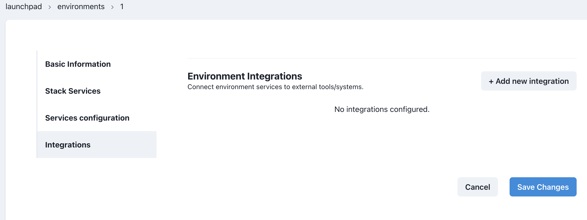

# How to send email notifications on DAG's failure

Getting notifications when there is a failure is critical for data teams and Airflow allows multiple ways to keep the users informed about the status of a DAG. You can learn more about them [here](https://www.bhavaniravi.com/apache-airflow/sending-emails-from-airflow) and [here](https://naiveskill.com/send-email-from-airflow/).

We're going to explain how you can send an email notification on DAG's failure. By the end of this page you will have: 
- Created an smtp Integration for Airflow
- Added the integration to your environment
- Created a DAG that makes use of the notification integration

By completing these steps you will be able to receive notifications upon DAG failure. 

Let's get started! 

## Create a new Integration

First, create a new integration of type `SMTP` by navigating to the Integrations Admin.


Click on the `+ New integration` button.

## Fill out the following fields

- **Name:** Provide a descriptive name such as `Mail Service `

- **Type:** Select `SMTP`

- **Host:** Enter the smtp server for your domain. 

- **Port:** TLS encryption on port 587. If you’d like to implement SSL encryption, use port 465. 

- **From Address:** This is the address that you have configured for smtp

- **User:** Same address as the `From Address` 

- **Password:** Password that you have configured for smtp


Click `Save Changes`

## Add integration to an Environment

Once you created the `SMTP` integration, it's time to add it to the Airflow service in an environment.

First, go to the `Environments` admin.


Select the Edit icon for the environment that has the Airflow service you want to configure, and then click on the `Integrations` tab.



Click on the `+ Add new integration` button, and then, select the integration you created previously. In the second dropdown select `Airflow` as service.


Click `Save Changes`. 

The Airflow service will be restarted shortly and will now include the SMTP configuration required to send emails.

>[!NOTE]You can skip this next step if going through the getting started guides since we will be completing the next step of the getting started guide: Start [developing DAGs](getting-started/Admin/creating-airflow-dags.md).

## Implement in a DAG

If you have already created a DAG it's time to modify your DAG to make use of our newly set up SMTP integration on Airflow. 

Simply provide a `default_args` dict like so:
>[!TIP]You can add as many email recipients needed by passing a list into the email field. eg) `email: ["gomezn@example.com", "mayra@example.com", "walter@example.com"]` 

### Python version

```python
import datetime

from airflow.decorators import dag
from operators.datacoves.dbt import DatacovesDbtOperator


@dag(
    default_args={
        "start_date": datetime.datetime(2023, 1, 1, 0, 0),
        "owner": "Noel Gomez",
        "email": "gomezn@example.com", # Can be a list ["email1", "email2",...]
        "email_on_failure": True,     # Email options
        # 'email_on_failure': False,  # Email options
        # 'email_on_retry': False,    # Email options
    },
    description="Sample DAG for dbt run",
    schedule_interval="0 0 1 */12 *",
    tags=["version_1"],
    catchup=False,
)
def dbt_run():
    build_dbt = DatacovesDbtOperator(
        task_id="run_dbt",
        bash_command="dbt run -s personal_loans", # Replace the name of the model
    )


dag = dbt_run()
```

### YAML version

```yaml
description: "Sample DAG for dbt run"
schedule_interval: "0 0 1 */12 *"
tags:
  - version_1
default_args:
  start_date: 2023-01-01
  owner: Noel Gomez
  # Replace with the email of the recipient for failures
  email: gomezn@example.com
  email_on_failure: true
  catchup: false

nodes:
  build_dbt:
    type: task
    operator: operators.datacoves.dbt.DatacovesDbtOperator
    bash_command: "dbt run -s personal_loans" # Replace the name of the model
```

## Getting Started Next Steps 

Start [developing DAGs](getting-started/Admin/creating-airflow-dags.md)