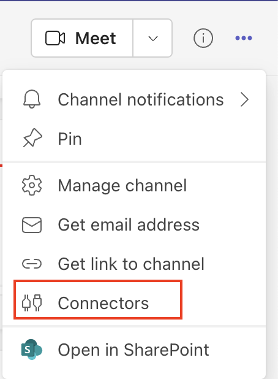
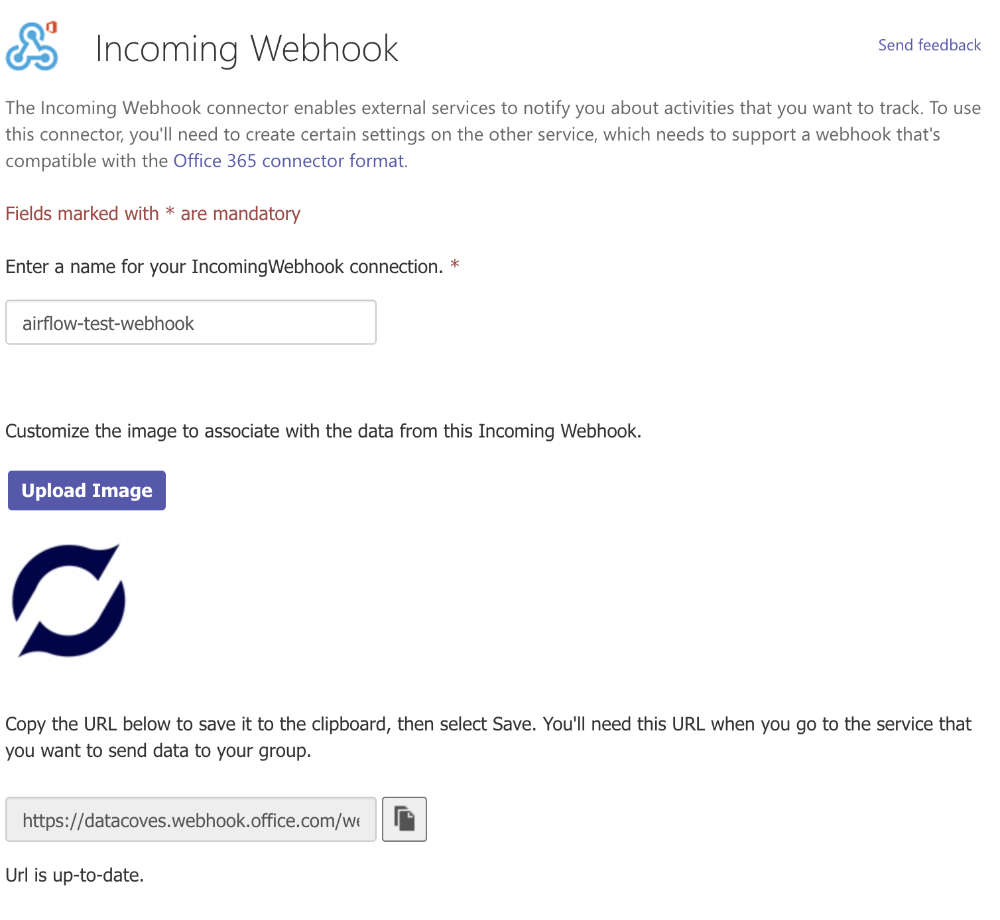
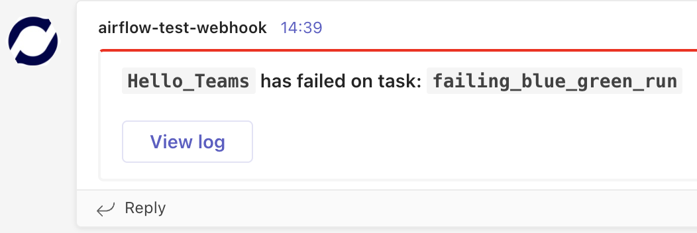

# How to send Microsoft Teams notifications on DAG's status

As stated in [how to send email notifications](/how-tos/airflow/send-emails.md), Airflow allows multiple ways to inform users about DAGs and tasks status.

Furthermore, it's important to understand Airflow handles these 4 status (`execute`, `failure`, `retry` and `success`) via callbacks. You can learn more about them [here](https://airflow.apache.org/docs/apache-airflow/2.2.1/logging-monitoring/callbacks.html)

Below we're going to explain how to use those callbacks to send Microsoft Teams notifications.

## Prepare Microsoft Teams

Sending messages through Teams is done using Webhooks. These connections can be assigned to MS Teams channels (unfortunately you can't configure a Hook to another user).

Enter the channel you want to send Airflow notifications to, click the `...` -> `Connectors` and search for `Incoming Webhook`.



Click `Configure`, give it a name, optionally select an image (it'll work as the sender's avatar), click `Create` and you will be given a webhook URL.



> **Warning**
> Keep this URL at hand, and in a safe place.

## Prepare Airflow

To connect your Airflow instance to Microsoft Teams, create a new Connection under `Admin` > `Connections`

It's important to notice that `Host` (the Webhook URL created previously) must not contain the `https://` prefix: `'https'` goes in `Schema`.

Also, keep your `Connection Id` at hand, it's the value you will use when configuring your DAGs and Tasks.


## Implement DAG

Once you set up both MS Teams and Airflow, it's time to start using Airflow Callbacks to notify your teams.

We will send a card with a 'View Log' button to the channel, that users can click on and go directly to the log of the Task.



### Python version

In this case, we will use this Operator to notify on failing tasks, using Airflow's `on_failure_callback`. 

> **Note:** You can replace `failure` with any of the events described at the beginning of this article (`on_[event]_callback` > `execute`, `failure`, `retry`, `success`)

First of all, import `MSTeamsWebhookOperator` into your DAG. Next, create a method that receives Airflow's run `context`, and calls the imported `MSTeamsWebhookOperator`. After creating it, set this method to the `on_failure_callback` property of the DAG

```python
import datetime
import os
import urllib.parse
from airflow import DAG
from ms_teams.ms_teams_webhook_operator import MSTeamsWebhookOperator

AIRFLOW_BASE_URL = os.environ.get("AIRFLOW__WEBSERVER__BASE_URL")

def ms_teams_send_logs(context):
    dag_id = context["dag_run"].dag_id
    task_id = context["task_instance"].task_id
    context["task_instance"].xcom_push(key=dag_id, value=True)
    timestamp = urllib.parse.quote(context['ts'])

    logs_url = f"{AIRFLOW_BASE_URL}/log?dag_id={dag_id}&task_id={task_id}&execution_date={timestamp}"
    ms_teams_notification = MSTeamsWebhookOperator(
        task_id="msteams_notify_failure", trigger_rule="all_done",
        message="`{}` has failed on task: `{}`".format(dag_id, task_id),
        button_text="View log", button_url=logs_url,
        theme_color="FF0000", http_conn_id='ms-teams-notifications')

    ms_teams_notification.execute(context)

default_args = {
    'owner' : 'airflow',
    'description' : 'a test dag',
    'start_date' : datetime(2019,8,8),
    'on_failure_callback': ms_teams_send_logs # IMPORTANT: it's the reference to the method, do not call() it
}
```

- `message`: card’s headline.
- `subtitle`: card’s subtitle
- `button_text`: text for action button at the bottom of the card
- `button_url`: what URL the button sends the user to
- `theme_color`: color for the card’s top line in HEX, without the #
- `http_conn_id`: `Connection Id` of the Airflow Connection created previously

### YAML version


```yaml
my_dag:
  start_date: 2021-01-01
  default_args:
    owner: airflow
    custom_callbacks:
        on_success_callback:
        module: callbacks.microsoft_teams
        callable: inform_success
        args:
            - connection_id: ms-teams-notifications # Airflow Connection Id
        on_failure_callback:
        module: callbacks.microsoft_teams
        callable: inform_failure
        args:
            - connection_id: ms-teams-notifications # Airflow Connection Id
  tasks:
    # ... your tasks here...
```
