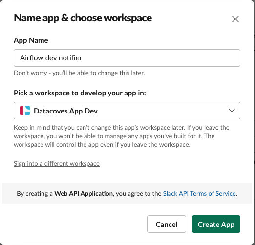
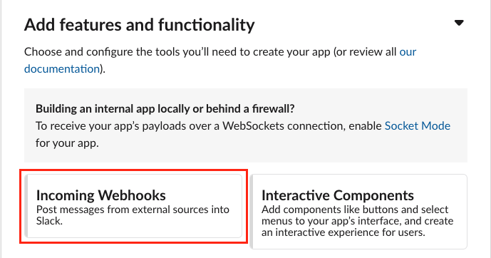
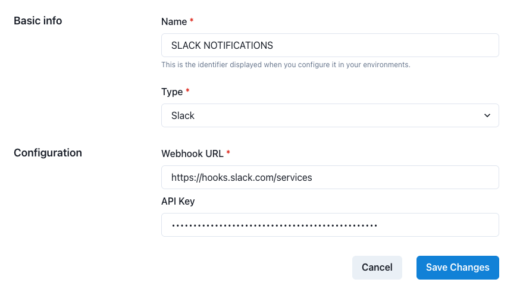

# How to send Slack notifications on DAG's status

As stated in [how to send email notifications](/how-tos/airflow/send-emails.md), Airflow allows multiple ways to inform users about DAGs and tasks status.

Furthermore, it's important to understand Airflow handles these 4 status (`failure`, `retry`, `success` and `missed SLA`) via callbacks. You can learn more about them [here](https://airflow.apache.org/docs/apache-airflow/2.2.1/logging-monitoring/callbacks.html)

Below we explain how to use those callbacks to send Slack notifications.

## Prepare Slack

To send messages in Slack, you must first create a Slack App, which will act as a "bot" that sends messages. Visit [https://api.slack.com/apps](https://api.slack.com/apps) to start


As it's the most basic type of application, you have to create it `from scratch`

After that, give it a `name` and assign it to your desired `workspace`




Once created, you must specify which features it will use. In order to send messages to your workspace channels, `Incoming Webhooks` is the only mandatory one.



In the `Incoming Webhooks` configuration screen, you must `toggle` the On/Off slider for the settings to appear. Once that's done, you can `Add New Webhook to Workspace`, where you will create `one webhook for each channel` you want to send messages to.


Once assigned a channel, your Incoming Webhook configuration screen will change to show your webhook `URL` and `Key`

The standard syntax of these are `url/key`, in our example: `https://hooks.slack.com/services` followed by `T05XXXXXX/XXXXXXXXX/XXXXXXXXX`


Now your Slack App is ready to send messages to `#airflow-notifications-dev` via webhooks.

## Prepare Airflow

### Create a new Integration

In Datacoves, create a new integration of type `Slack` by navigating to the Integrations admin page.


Click on the `+ New integration` button.

Provide a name and select `Slack`.



Provide the required details and `Save` changes.

>[!TIP]The name you specify will be used to create the Airflow-Slack connection. It will be uppercased and joined by underscores -> `'SLACK NOTIFICATIONS'` will become `SLACK_NOTIFICATIONS`. You will need this name below.

### Add integration to an Environment

Once the `Slack` integration is created, it needs to be associated with the Airflow service within a Datacoves environment.

Go to the `Environments` admin screen.


Edit the environment that has the Airflow service you want to configure and click on the `Integrations` tab.


Click on the `+ Add new integration` button and select the integration you created previously. In the second dropdown select `Airflow` as the service.


`Save` changes. The Airflow service will be restarted and will include the Slack configuration required to send notifications.

## Implement DAG

Once Slack and Airflow are configured, you can start using the integration within Airflow Callbacks to send notifications to your Slack channel.

Slack will receive a message with a 'Logs' link that users can click on and go directly to the Airflow log for the Task.

### Callback Configuration

In the examples below, we will send a notification on failing tasks or when the full DAG completes successfully using our custom callbacks: `inform_failure` and `inform_success`.

>[!NOTE]In addition to `inform_failure` and `inform_success`, we support these callbacks `inform_failure`, `inform_success`, `inform_retry`, `inform_sla_miss`

To send Slack notifications, in the Airflow DAG we need to import the appropriate callbacks and create a method that receives the following mandatory parameters:

- `context` This is provided by Airflow
- `connection_id`: the name of the Datacoves Integration created above

Additionally, `message` can be passed to customize the message sent to Slack

### Python version

```python
import datetime

from airflow.decorators import dag
from callbacks.slack_messages import inform_failure, inform_success
from kubernetes.client import models as k8s
from operators.datacoves.dbt import DatacovesDbtOperator


def run_inform_success(context):
    inform_success(context, connection_id="DATACOVES_SLACK", color="0000FF")


def run_inform_failure(context):
    inform_failure(context, connection_id="DATACOVES_SLACK", color="9900FF")


TRANSFORM_CONFIG = {
    "pod_override": k8s.V1Pod(
        spec=k8s.V1PodSpec(
            containers=[
                k8s.V1Container(
                    name="transform",
                    image="datacoves/airflow-pandas:latest",
                    resources=k8s.V1ResourceRequirements(
                        requests={"memory": "8Gi", "cpu": "1000m"}
                    ),
                )
            ]
        )
    ),
}


@dag(
    default_args={
        "start_date": datetime.datetime(2023, 1, 1, 0, 0),
        "owner": "Noel Gomez",
        "email": "gomezn@example.com",
        "email_on_failure": True,
    },
    description="Sample DAG with Slack notification, custom image, and resource requests",
    schedule_interval="0 0 1 */12 *",
    tags=["version_2", "slack_notification", "blue_green"],
    catchup=False,
    on_success_callback=run_inform_success,
    on_failure_callback=run_inform_failure,
)
def yaml_slack_dag():
    transform = DatacovesDbtOperator(
        task_id="transform",
        bash_command="dbt run -s personal_loans",
        executor_config=TRANSFORM_CONFIG,
    )


dag = yaml_slack_dag()
```

### YAML version

```yaml
description: "Sample DAG with Slack notification, custom image, and resource requests"
schedule_interval: "0 0 1 */12 *"
tags:
  - version_2
  - slack_notification
  - blue_green
default_args:
  start_date: 2023-01-01
  owner: Noel Gomez
  # Replace with the email of the recipient for failures
  email: gomezn@example.com
  email_on_failure: true
catchup: false


# Optional callbacks used to send Slack notifications
custom_callbacks:
  on_success_callback:
    module: callbacks.slack_messages
    callable: inform_success
    args:
      connection_id: DATACOVES_SLACK
      # message: Custom success message
      color: 0000FF
  on_failure_callback:
    module: callbacks.slack_messages
    callable: inform_failure
    args:
      connection_id: DATACOVES_SLACK
      # message: Custom error message
      color: 9900FF

# DAG Tasks
nodes:
  transform:
    operator: operators.datacoves.dbt.DatacovesDbtOperator
    type: task
    config:
      image: datacoves/airflow-pandas:latest
      resources:
        memory: 8Gi
        cpu: 1000m

    bash_command: "dbt run -s personal_loans"
```
## Getting Started Next Steps 

Start [developing DAGs](getting-started/Admin/creating-airflow-dags.md)