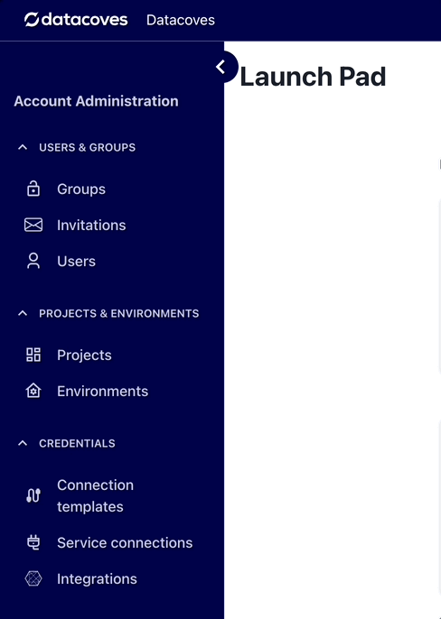
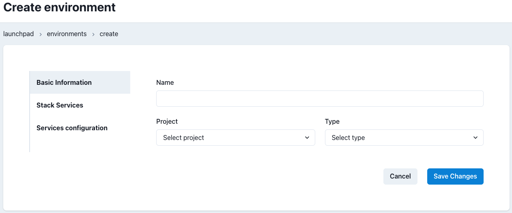
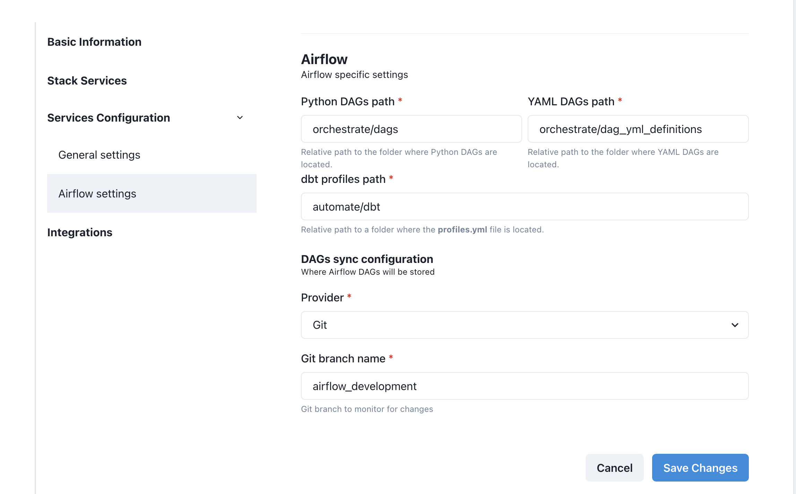

# How to Create/Edit an Environment

Navigate to the Environments page

To create a new environment click the `New Environment` button.

Environment Settings are separated into different tabs.

## Basic information
This tab has the base information for the environment.

  - The `name` to be displayed on the launchpad
  - The `Project` the environment should be associated with
  - The `type` of environment (development, test or prod). It is best practice for users to perform their work in a development environment and production jobs to run in a production environment which is typically more governed.

## Stack Services
Define which tools will be enabled for this environment. At least one service must be enabled. 

Available services include:
- `LOAD (Airbyte)`
- `TRANSFORM (dbt and VS Code)`
- `OBSERVE (dbt docs)`
- `ORCHESTRATE (Airflow)`
- `ANALYZE (Superset)`

## Services Configuration
The services enabled for the environment may require additional configurations. This tab is where the services will be configured. 
  
For example: 

- TRANSFORM (dbt & VS Code) requires:
  -  **dbt project path** the path the location of the `dbt_project.yml` this allows you to either have the dbt project at the root of your git repository or in some sub-folder.
- ORCHESTRATE (Airflow) requires: 
  - **branch** Determines git branch to synchronize to Airflow. This allows you to have one branch like `airflow_development` for a development environment and use `main` on a production environment.
  - **dbt profiles path** The location where Airflow will find dbt profiles.yml file to use during a dbt run.
  - **YAML DAGs path** When using yml based Airflow DAGs Airflow will look for the yml files in this location.
  - **Python DAGs path** This is the location Airflow will look for the DAG definition files
- OBSERVE (Docs) requires:
  -  **branch** Here we specify the branch that will be synchronized for production dbt docs. This branch must exist in your git repository.
  

