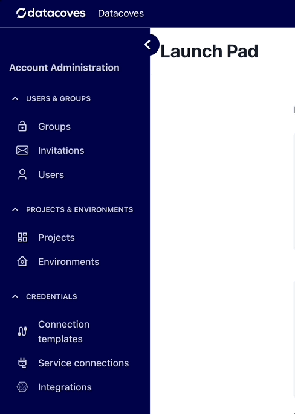

# How to Create/Edit a Service Connection

Navigate to the Service Connection page



To create a new Service Connection click the `New Connection` button.

Select the environment you wish to configure.


A Service Connection consists of the following fields:

- **Name** Defines how the connection will be referred to by the automated service. Should be called `main` and will be included in the name of the environment variables seen below.
- **Environment** The Datacoves environment associated with this service connection.
- **Service** The Datacoves stack service where this connection should be made available e.g. Airflow
- **Connection Template** The connection template to base this service connection on(i.e. the defaults)
  Depending on the template selected, additional fields will be displayed with the default values entered in the connection template. These default values can be overridden by toggling the indicator next to the given value. Enter the appropriate user, schema, and password. In dev this will be your personal credentials, in prod it should be a service account.


The name of the service connection will be used to dynamically create environment variables seen below which we inject into Airflow. 

>[!TIP] These variables can be used in your profiles.yml file and will allow you to safely commit them with git. The available environment variables will vary based on your data warehouse.

  - `DATACOVES__<NAME>__ROLE`
  - `DATACOVES__<NAME>__ACCOUNT`
  - `DATACOVES__<NAME>__WAREHOUSE`
  - `DATACOVES__<NAME>__ROLE`
  - `DATACOVES__<NAME>__DATABASE`
  - `DATACOVES__<NAME>__SCHEMA`
  - `DATACOVES__<NAME>__USER`
  - `DATACOVES__<NAME>__PASSWORD`

## Create a profiles.yml

Now that you have created a service connection you will need to create your and your `profiles.yml`

**Step 1:** Create the `automate` folder at the root of your project

**Step 2:** Create the `dbt` folder inside the `automate` folder 

**Step 3:** Create the `profiles.yml` inside of your `automate` folder. ie) `automate/dbt/profiles.yml`

**Step 4:** C opy the following configuration into your `profiles.yml`

### Snowflake
``` yaml
default:
  target: default_target
  outputs:
    default_target:
      type: snowflake
      threads: 8
      client_session_keep_alive: true

      account: "{{ env_var('DATACOVES__MAIN__ACCOUNT') }}"
      database: "{{ env_var('DATACOVES__MAIN__DATABASE') }}"
      schema: "{{ env_var('DATACOVES__MAIN__SCHEMA') }}"
      user: "{{ env_var('DATACOVES__MAIN__USER') }}"
      password: "{{ env_var('DATACOVES__MAIN__PASSWORD') }}"
      role: "{{ env_var('DATACOVES__MAIN__ROLE') }}"
      warehouse: "{{ env_var('DATACOVES__MAIN__WAREHOUSE') }}"
```
### Redshift 
```yaml
company-name:
  target: dev
  outputs:
    dev:
      type: redshift
      host: "{{ env_var('DATACOVES__MAIN__HOST') }}"
      user: "{{ env_var('DATACOVES__MAIN__USER') }}"
      password: "{{ env_var('DATACOVES__MAIN__PASSWORD') }}"
      dbname: "{{ env_var('DATACOVES__MAIN__DATABASE') }}"
      schema: analytics
      port: 5439
      
      # Optional Redshift configs:
      sslmode: prefer
      role: None
      ra3_node: true 
      autocommit: true 
      threads: 4
      connect_timeout: None
```
### BigQuery
```yaml
my-bigquery-db:
  target: dev
  outputs:
    dev:
      type: bigquery
      method: service-account
      project: GCP_PROJECT_ID
      dataset:  "{{ env_var('DATACOVES__MAIN__DATASET') }}"
      threads: 4 # Must be a value of 1 or greater
      keyfile:  "{{ env_var('DATACOVES__MAIN__KEYFILE_JSON') }}"
```
### Databricks
```yaml
your_profile_name:
  target: dev
  outputs:
    dev:
      type: databricks
      catalog: [optional catalog name if you are using Unity Catalog]
      schema: "{{ env_var('DATACOVES__MAIN__SCHEMA') }}" # Required
      host: "{{ env_var('DATACOVES__MAIN__HOST') }}" # Required
      http_path: "{{ env_var('DATACOVES__MAIN__HTTP_PATH') }}" # Required
      token: "{{ env_var('DATACOVES__MAIN__HOST') }}" # Required Personal Access Token (PAT) if using token-based authentication
      threads: [1 or more]  # Optional, default 1
```

## Getting Started Next Steps 
**Set up notifications**
- **Email:** [Setup Email Integration](how-tos/airflow/send-emails)

- **MS Teams:** [Setup MS Teams Integration](how-tos/airflow/send-ms-teams-notifications)

- **Slack:** [Setup Slack Integration](how-tos/airflow/send-slack-notifications)