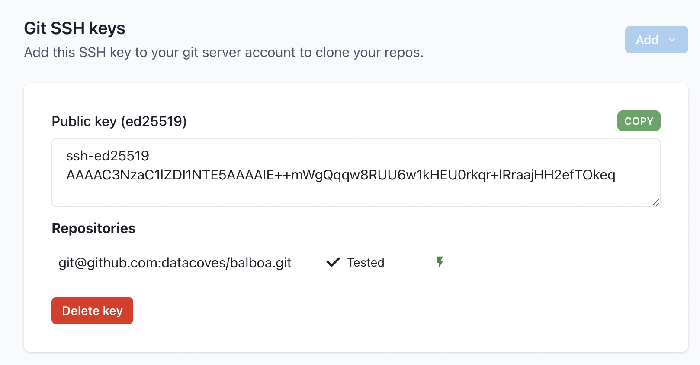
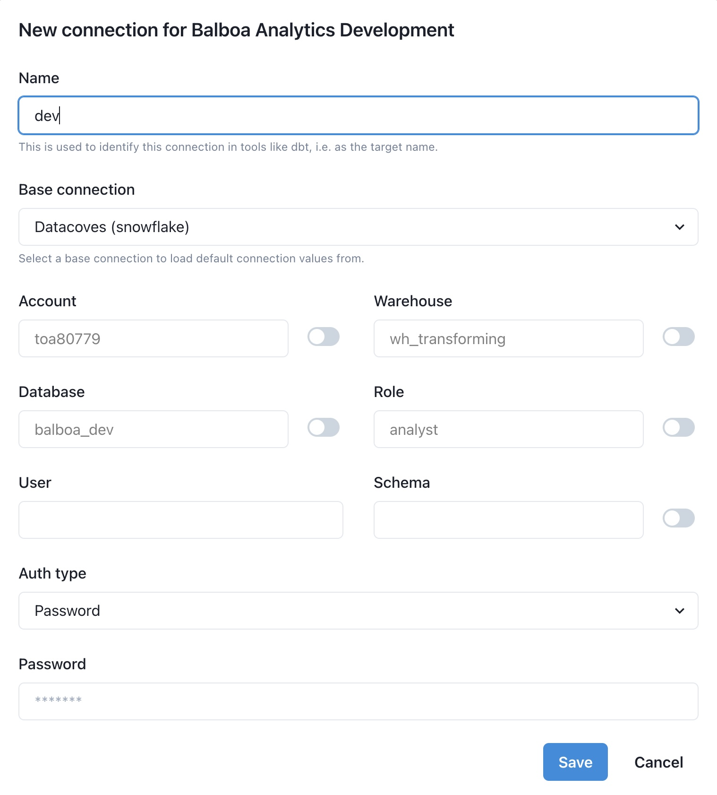

# How to Configure your VS Code in the Datacoves Transform tab

When you first log into Datacoves, you will see that VS Code is disabled.

We need to connect to your git repository and to your data warehouse and configure your dbt profiles.yml. To do this, you need to update your user settings.

## Open Your User Settings

At the top right corner of the page, click the User icon and select _Settings_


## Setup git connection credentials

On the settings page scroll down to the Git SSH keys section.


Click the Add drop down and select whether you want to provide an existing private key or have Datacoves auto generate one for you.


Datacoves will generate and display the corresponding public key, you will need to configure the public key for your git provider.


Click the _Copy_ button and follow the instructions to configure the public key for your git server.

[Github SSH Key Configuration Instructions](https://docs.github.com/en/authentication/connecting-to-github-with-ssh/adding-a-new-ssh-key-to-your-github-account)

[Gitlab SSH Key Configuration Instructions](https://www.theserverside.com/blog/Coffee-Talk-Java-News-Stories-and-Opinions/How-to-configure-GitLab-SSH-keys-for-secure-Git-connections#:~:text=Configure%20GitLab%20SSH%20keys,-Log%20into%20GitLab%20and%20click)

[Bitbucket SSH Key Configuration Instructions](https://dev.to/jorge_rockr/configuring-ssh-key-for-bitbucket-repositories-2925)

Once your public SSH key has been added to your git server, test your connection.


If Datacoves is able to connect to your Git repository, you will see _Tested_ next to the repository url.



## Setup Snowflake Keys

When connecting to Snowflake, you can use either key based authentication or username/password authentication.

>[!NOTE]To enable key-pair authentication, you admin must select `Inferred from user info using a custom template` when setting up the [Connection Template](/how-tos/datacoves/setup/how_to_connection_template.md). The Snowflake username must match the username associated with the email used to authenticate with Datacoves for example `some_user` would be the snowflake username for `some_user@example.com`, please let us know if your username is different.

If using key based authentication, you will need to provide or generate a key which will need to be added to Snowflake manually or contact us for information on how to automate this integration with Snowflake.

Provide or automatically generate your keys. Then add the public key to Snowflake.


## Assign the public key to the Snowflake User

```
alter user <username> set rsa_public_key='<public key>';
```

More information can be found in the [Snowflake Documentation](https://docs.snowflake.com/en/user-guide/key-pair-auth.html#step-4-assign-the-public-key-to-a-snowflake-user)

## Setup Snowflake Connection

In the Database Connection Section, click _Add_


Give the connection a name, this will be used as your dbt target name and is typically _dev_. Next select a connection template. (A connection template will have defaults pre-configured by your administrator).


Fill in the rest of the fields and click _Save_

Datacoves will test the connection and display _Tested_ next to the connection if successful. Note that you can create additional dbt targets as shown below. This will allow you to execute dbt commands passing a specific target such as `dbt run my_model -t prd`



You are now ready to transform your data with dbt. Scroll to the top of the screen, click _Launchpad_ or the Datacoves logo, then click *Open* to go into your development environment. Note, Datacoves will take a couple of minutes to apply the new settings, clone your repo, and finish setting up your environment for the first time.


