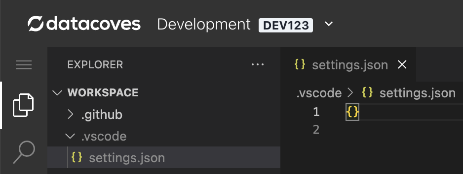
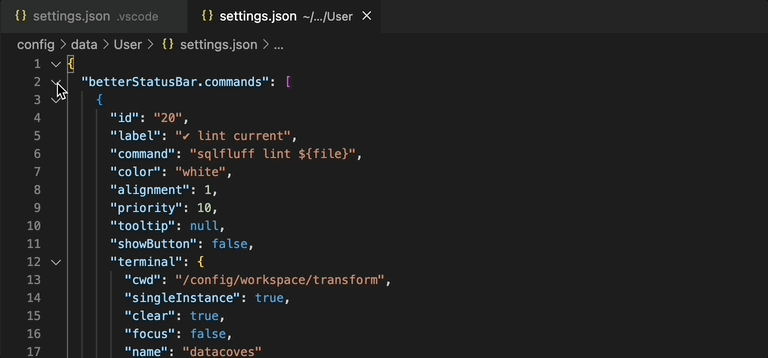

# How to override default VS Code settings

Once you have [set up your Visual Studio Code](/how-tos/datacoves/transform/initial) environment, you have the possibility to override certain settings we provide by default. This is done in your Workspace settings.

## Create your workspace settings file

Create a VS Code `settings.json` file under `.vscode/` in your repository root (make sure to add it to your `.gitignore` to keep it out of version control)



## Override settings

To override a setting, simply specify it's `key:value`.

For example, to change the line length at which VS Code shows it's ruler:

```json
{
  "editor.rulers": [140]
}
```

## How to customize the Status Bar

The defaults can be overridden for customization such as what buttons appear in the status bar, the order and more.

### Read default Datacoves settings

To see our default settings, which will serve as example for you to overwrite in your own workspace `settings.json`, press `F1` to open VS Code's command palette and select `Open User Settings (JSON)`.


### Copy the betterStatusBar.commands
>[!NOTE]Only the commands you copy over to your settings.json will be available to you, so we recommend copying over all of them to avoid losing any during the customization process. 

Paste them in your .vscode/settings.json file



### Edit the buttons that show up in the bar

Below you can see the structure of the command entry.

```JSON
    {
      "id": "30",
      "label": "✔️ Run checks",
      "command": "pre-commit run",
      // "command": "pre-commit run --from-ref origin/main --to-ref HEAD",
      "color": "lightgray",
      "alignment": 1,
      "priority": 10,
      "tooltip": null,
      "showButton": false,
      "terminal": {
        "cwd": "/config/workspace/transform",
        "singleInstance": true,
        "clear": true,
        "focus": false,
        "name": "datacoves"
      }
    },
```
**You may wish to edit:**

- **Order of commands**: The order the commands are displayed in the `More` dropdown as well as the status bar is determined by the order in which the commands are defined in the settings.json
  
  ie) If you want `Run checks` to come up first in the `More` drop down as well as first (left to right) in the bar, then simply take the entry and place it at the top. You can move all of your displayed buttons to the top of the list and organize them.
  
- **label**: To change the text that shows up on the button and in the `More` dropdown, edit the "label" variable.
  
- **color**: To change the color of the text for the button edit the "color" variable. This can be a color name or a hex code eg) "purple" or "#800080"
  
-**showButton**: You can customize the buttons displayed in the status bar to fit your needs. To do this simply change "showButton": `true` for the button to populate in the bar and `false` to remove the button from the bar.
  
- **Tool tips**: To change the hover message, edit the "tooltip" variable and add a string with the message you'd like to display upon hovering. If you decide to add a button to the status bar that was not there by default, its tooltip will likely be `null`. This will default to `"betterStatusBar.<id>"`

>[!ATTENTION]These customizations will only be available in the individual user workspace. To fix this, the settings.json can be committed to version control and shared across developers, however, if you choose this method **DO NOT store any secrets in the the settings.json** since they will be committed to version control.
