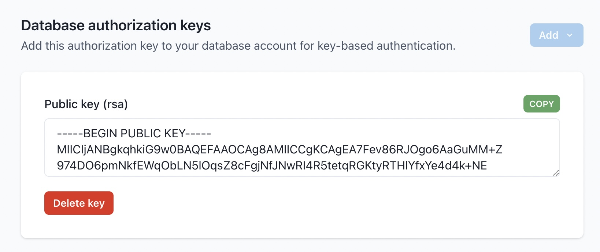

# Snowflake Setup

## Setup Snowflake with Key Pair

When connecting to Snowflake, you can use either key based authentication or username/password authentication.

>[!NOTE]To enable key-pair authentication, you admin must select `Inferred from user info using a custom template` when setting up the [Connection Template](/how-tos/datacoves/admin/how_to_connection_template.md). The Snowflake username must match the username associated with the email used to authenticate with Datacoves for example `some_user` would be the snowflake username for `some_user@example.com`, please let us know if your username is different.

If using key based authentication, you will need to provide or generate a key which will need to be added to Snowflake manually or contact us for information on how to automate this integration with Snowflake.

Provide or automatically generate your keys. Then add the public key to Snowflake.



## Assign the public key to the Snowflake User

```
alter user <username> set rsa_public_key='<public key>';
```

More information can be found in the [Snowflake Documentation](https://docs.snowflake.com/en/user-guide/key-pair-auth.html#step-4-assign-the-public-key-to-a-snowflake-user)

## Complete the connection

In the Database Connection Section, click `Add`


Give the connection a name. 

>[!TIP]This will be used as your dbt target name and is typically `dev`. 

Next select a connection template. A connection template will have defaults pre-configured by your administrator.


## Fill in connection details

Datacoves will test the connection and display `Tested` next to the connection if successful. 

>[!NOTE]You can create additional dbt targets as shown below. This will allow you to execute dbt commands passing a specific target such as `dbt run my_model -t prd`


### Key Pair 

If using key pair, you will need to change the auth method to key-pair.


Select the drop down and your key you configured earlier should populate.


Click `Save`