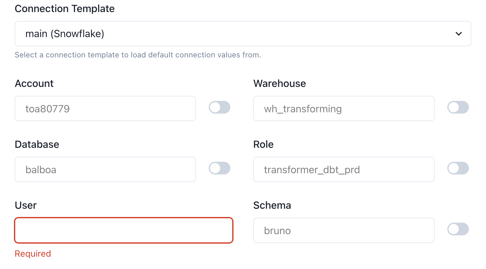
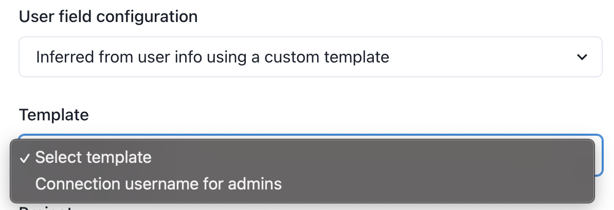

# Connection Templates Admin

## Overview

A Connection Template in Datacoves defines the basic information for your data warehouse. It acts as a template that can then be used for user and service connections. This simplifies the onboarding process for users.

## Connection Templates Listing

On the Connection Templates landing page you can see a list of Connection Templates associated with each of your Datacoves projects.

For each template we can see the provider (i.e. Snowflake, Redshift) and the number of service and user accounts associated with each template.

Each row contains 2 action buttons, Edit and Delete.

## Create/Edit Connection Template

To create a new connection template click the `Create Connection Template` button.

Each Connection Template consist of the following fields:

- **Name** This is the name users will see when selecting the base connection template when entering credentials for themselves or service accounts.
- **Enabled for users** This flag indicates whether this template will be available for users or only for service accounts. To simplify the end-user experience, it is best to show them only the primary template they should use when entering their credentials. If enabled, a new field will appear:

  - **User field configuration** Defines how the DB connection `Username` field will be treated. It can be `provided` by the end-user or inferred using two strategies: from his/her email, or based on templates.
    The difference in these approaches will be noticed when the final user creates their respective connections in `Settings -> Database connections`
    - **Provided by user** With this strategy, the user will have free access to write the desired username when creating a connection
      
    - **Inferred from user's email** Defines the username field as read-only, pre-populating it with the user's email username (what comes before @domain.com)
      
    - **Inferred from user info using a custom template** With this last approach, you can choose a template from which the username will be generated. If selected a new field will appear to select one of those.
      
      At this moment we only support our provided `Connection username for admins` template. With this template, the username will see `admin_{{username}}` when creating a DB connection.
      

- **Project** This defines the Datacoves project that should be associated with this connection template
- **Type** Defines the data warehouse provider so that users are presented the appropriate fields when entering their credentials.
- **Provider connection details** Based on the Provider Type selected, available default parameters will be displayed.
  - For Snowflake, the available fields are: `Account`, `Warehouse`, `Database`, and `Role`
    
  - For Redshift, the available fields are: `Host` and `Database`
    
