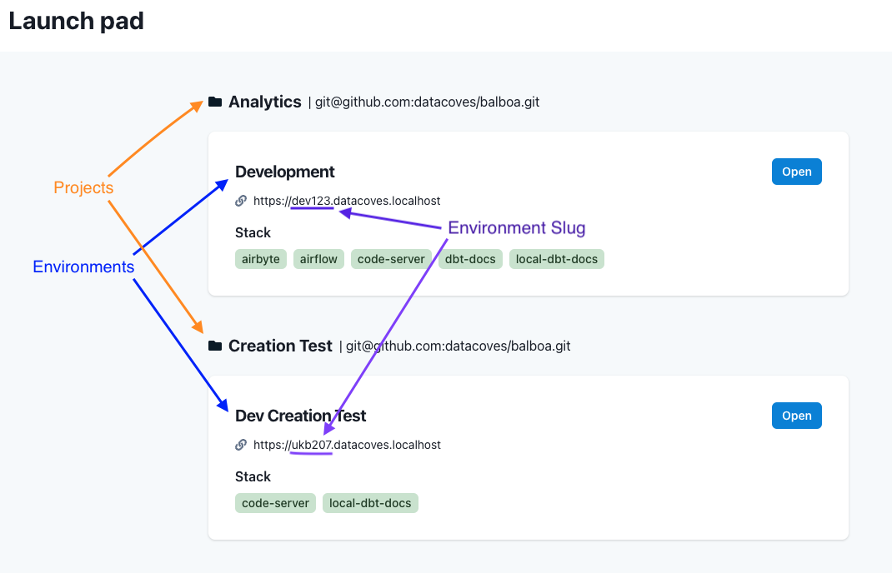
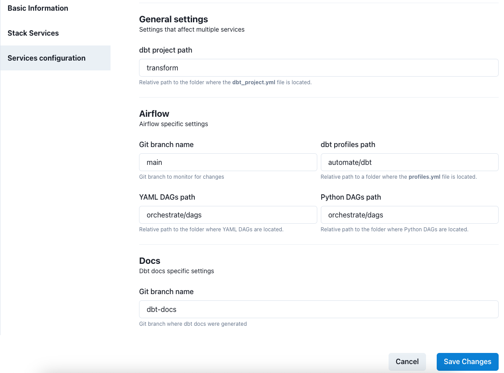

# Environments Menu

## Concept

<!-- TODO: Get a proper well-writen concept of what an Environment in Datacoves is -->
An Environment in Datacoves is each of the ETL instances inside a [Project](/reference/admin-menu/projects.md). It's each of the listed workspaces you can `Open` in your Datacoves landing page (also called Launch pad)

## Landing

In the landing page of Environments' Menu, you can see a list of Environments linked to one or more Projects. In each of them, how many Service Connections are in use inside it.

## Create/Edit Project

Each Environment consist of three main components:
- Basic information: `name`, the `Project` it belongs to, and it's `type` (dev, test or prod)
- A `stack`: which solutions it's using: `TRANSFORM`, `OBSERVE`, `LOAD`, `ORCHESTRATE`, `ANALYZE`
    
- Depending on which of the solutions it's using, one or more `services configuration` will be required, for example:
    - TRANSFORM requires the path where `dbt_project.yml` is located
    - ORCHESTRATE (Airflow) will require:
        - A `branch` to monitor changes
        - The paths where `profiles.yml`, `YAML DAGs` and `Python DAGs` reside
    - DBT DOCS requires a dedicated docs branch in your Repository

