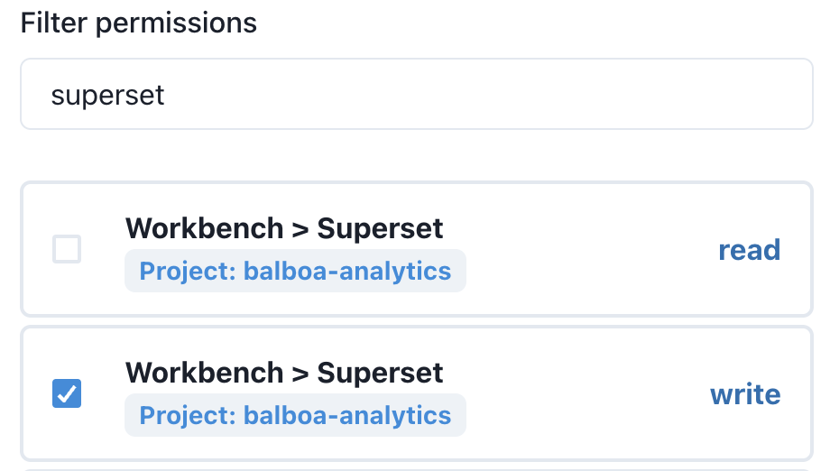
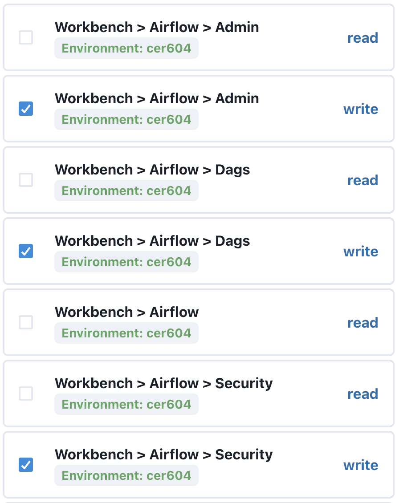

# Connection Templates Admin

## Overview

A Group in Datacoves is a collection of permissions, which can be assigned to your account's users.
By default, one group comes shipped with your account, the `Account Admin`. Also, when you create a [Project](/reference/admin-menu/projects.md) or an [Environment](/reference/admin-menu/environments.md), two groups are created for each of them: `Project/Environment Developer` and `Project/Environment Viewer`

## Groups Listing

On the Groups landing page you can see your account's list of groups

For each group we can see it's name, the amount of permissions it has enabled, and how many users are using it.

Each row contains 2 action buttons, Edit and Delete.

## Create/Edit Group

Each group consist of three main components:

- `Name`
- `Description` (to help identify what each group permits and restricts)
- A list of `Permissions`, which consist of single `read` and `write` authorizations, to help granulate the user experience as much as possible.

In terms of specific application permissions, i.e. Airflow and Superset, you can use both general and specific scopes:

- To work permissions at global level (the entire application), you can give `read` or `write` permissions to it's entire scope:

  

  - Giving an application scope `write` access, gives the group the entire set of the application's permissions, and with it also to it's resources.
  - Giving an application scope `read` access, sets the group as viewer (read-only)

- To give permissions to certain resources of an application, you can toggle `write` access on only those of interest, leaving the general scope (for example, `Workbench>Airflow`) unmarked.

  

  Some of the specific component permissions include:

  - `Airflow > Admin`: access to Airflow's Admin menu (connections, variables, etc)
  - `Airflow > Security`: access to Airflow's Security menu (users and roles administration)
  - `Airflow > Dags`: running DAGs and jobs
  - `Superset > Data-Sources`: Superset data sources administration
  - `Superset > Security`: access to Superset's Security menu (users, roles, permissions, etc.)

Apart from these main fields, you can specify a comma-separated list of `Active Directory groups`, as well as `Filter` the available permissions to enable/disable them with ease.

