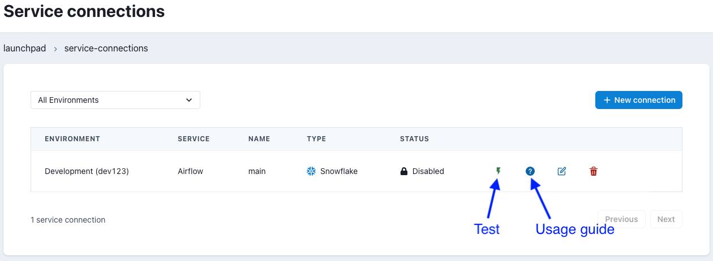
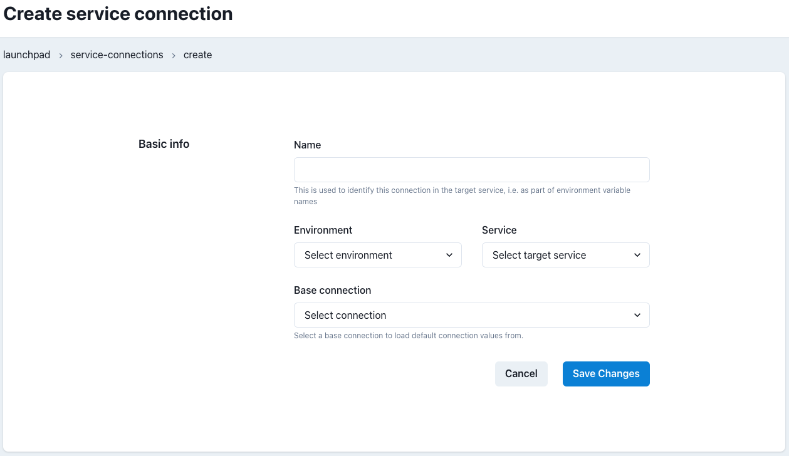

# Service Connections Admin

## Overview

Service Connections are used by automated processes like Airflow jobs. Information entered here are injected as ENVIRONMENT variables that can then be used in a dbt profiles.yml file to establish a connection with your data warehouse.

## Service Connection Listing

On the Service Connections landing page you can see a list of service connections associated with each of your environments.

For each environment we can see the associated environment, the service that uses the connection, the name of the service connection, the warehouse type, and whether the connection was tested to assure the credentials are valid.

Each row contains 3 action buttons, Test Connection, How to use the connection(?), Edit, and Delete.

Clicking the (?) icon will show the names of the ENVIRONMENT variables that will be injected into the service. These are what you must use in your dbt profiles.yml file.

## Create/Edit Service Connection

To create a new Service Connection click the `New Connection` button.

A Service Connection consists of the following fields:

- **Name** Defines how the connection will be referred to by the automated service and will be included in the name of the environment variable like `DATACOVES__<name>__ROLE`
- **Environment** The Datacoves environment associated with this service connection.
- **Service** The Datacoves stack service where this connection should be made available e.g. Airflow
- **Connection Template** The connection template to base this service connection on(i.e. the defaults)
  Depending on the template selected, additional fields will be displayed with the default values entered in the connection template. These default values can be overridden by toggling the indicator next to the given value.

